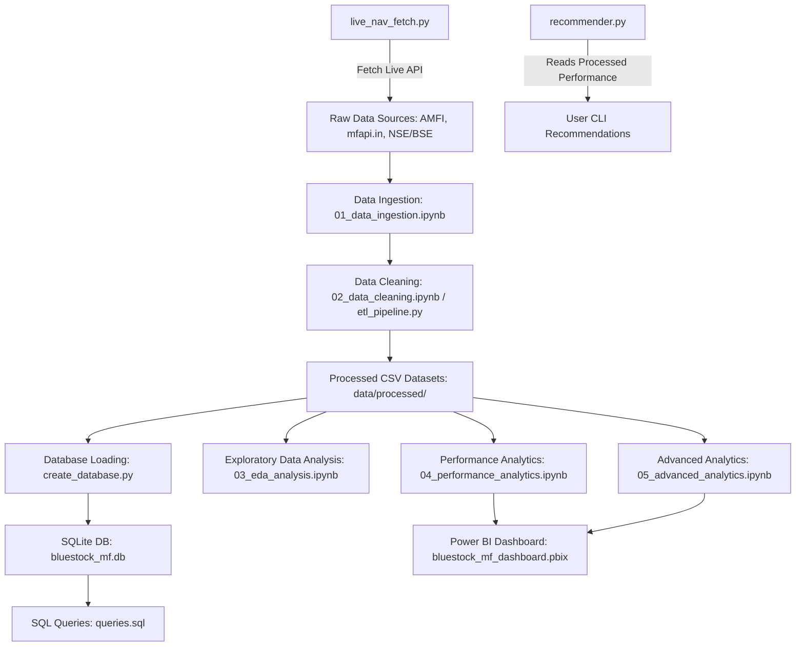

# 📊 Bluestock Fintech – Mutual Fund Analytics Platform

> **Capstone Project:** An end-to-end data engineering and analytics platform designed to ingest, clean, store, analyze, and visualize mutual fund performance, risk metrics, and investor transaction data.

---

## 🚀 Project Overview

The **Mutual Fund Analytics Platform** provides deep financial and operational insights into mutual fund schemes, fund houses (AMCs), sector allocations, monthly SIP trends, and investor demographics. 

By integrating historical data from various sources (AMFI, mfapi.in, NSE, BSE), the platform computes advanced metrics like **Sharpe Ratio**, **Sortino Ratio**, **Alpha**, **Beta**, **Value at Risk (VaR)**, and **Herfindahl-Hirschman Index (HHI)**. It stores them in a robust SQLite database warehouse and visualizes findings in an interactive Power BI dashboard.

---

## 🛠️ Key Features

- **Automated Data Processing (ETL):** Full extraction, cleaning, and transformation pipelines handling raw CSV data.
- **Live NAV Integration:** Fetches real-time mutual fund NAV values using public REST APIs (`api.mfapi.in`).
- **Performance & Advanced Analytics:** Calculates standard deviation, volatility, drawdown, Sharpe/Sortino ratios, VaR, CVaR, portfolio sector concentration, and investor segmentation.
- **Relational Database Warehouse:** Integrates clean datasets into structured Star Schema tables using Python and SQLAlchemy.
- **CLI Recommender Engine:** A dynamic command-line interface that suggests the top-performing mutual funds based on the user's risk profile (Low, Moderate, High, Very High) and Sharpe ratio.
- **Interactive Business Intelligence Dashboard:** A premium Power BI dashboard visualizing investor distributions, AUM growth, sector heatmaps, and fund comparison charts.

---

## 📐 Platform Architecture



---

## 📁 Repository Structure

```text
bluestock_mf_capstone/
├── dashboard/
│   └── bluestock_mf_dashboard.pbix      # Interactive Power BI dashboard file
├── data/
│   ├── db/
│   │   └── bluestock_mf.db              # SQLite Database housing final tables
│   ├── processed/                       # Cleaned, structured datasets (CSV)
│   │   ├── alpha_beta.csv
│   │   ├── clean_aum_by_fund_house.csv
│   │   ├── clean_benchmark_indices.csv
│   │   ├── clean_category_inflows.csv
│   │   ├── clean_fund_master.csv
│   │   ├── clean_industry_folio_count.csv
│   │   ├── clean_monthly_sip_inflows.csv
│   │   ├── clean_nav.csv
│   │   ├── clean_performance.csv
│   │   ├── clean_portfolio_holdings.csv
│   │   ├── clean_scheme_performance.csv
│   │   ├── clean_transactions.csv
│   │   ├── fund_scorecard.csv
│   │   └── var_cvar_report.csv
│   └── raw/                             # Ingested raw source files (CSV)
├── notebooks/                           # Step-by-step Jupyter notebooks
│   ├── 01_data_ingestion.ipynb
│   ├── 02_data_cleaning.ipynb
│   ├── 03_eda_analysis.ipynb
│   ├── 04_performance_analytics.ipynb
│   └── 05_advanced_analytics.ipynb
├── reports/                             # Exported reports & visual charts
│   ├── charts/                          # Exported analytical PNG figures
│   ├── Bluestock_MF_Presentation.pptx   # Final presentation PowerPoint
│   ├── Dashboard.pdf                    # PDF export of Power BI pages
│   └── final_report.pdf                 # Final capstone writeup
├── scripts/                             # Executable pipeline scripts
│   ├── create_database.py               # Generates SQLite database and tables
│   ├── etl_pipeline.py                  # Standard ingestion skeleton script
│   ├── live_nav_fetch.py                # Fetches live NAV from mfapi.in API
│   ├── recommender.py                   # Mutual Fund CLI recommendation engine
│   └── run_pipeline.py                  # Master orchestration execution file
├── sql/                                 # SQL schemas and analysis scripts
│   ├── queries.sql                      # 10 business analytical queries
│   └── schema.sql                       # Database schemas and keys
├── data_dictionary.md                   # Data models and column descriptions
└── requirements.txt                     # Project python dependencies
```

---

## 🗃️ Database Schema & SQL Queries

The SQLite database `data/db/bluestock_mf.db` organizes the cleaned data into relational tables optimized for querying and dashboard reporting.

### Relational Tables
- **`dim_fund`**: Scheme identifiers, names, categories, expense ratios, risk levels, and fund managers.
- **`fact_nav`**: Daily historical net asset values (NAV) for tracking performance.
- **`fact_transactions`**: Simulated investor actions, transaction types, volumes, payment modes, and demographics.
- **`fact_performance`**: Pre-calculated metrics like Sharpe ratios, annualized standard deviation, Morningstar ratings, alpha, and beta.
- **`fact_aum`**: Quarterly Assets Under Management (AUM) trends per fund house.

*Refer to the full [data_dictionary.md](data_dictionary.md) for a comprehensive list of column types and relationships.*

### Example Analytical Queries
SQL analyses available in [queries.sql](sql/queries.sql) include:
- Finding top 5 fund houses by AUM.
- Evaluating average monthly NAV trends.
- Identifying investor demographics and transaction volumes per state.
- Ranking funds based on Sharpe and Sortino ratios.

---

## 📓 Jupyter Notebooks Walkthrough

The core analytical workflow is documented and executed in five progressive Jupyter Notebooks inside the [notebooks/](notebooks/) directory:

1. **`01_data_ingestion.ipynb`**: Handles loading raw CSV files from source paths and runs validation checks on formats, headers, and rows.
2. **`02_data_cleaning.ipynb`**: Identifies missing data, standardizes date fields, strips trailing spaces, cleans strings, and exports tidy files to `data/processed/`.
3. **`03_eda_analysis.ipynb`**: Performs exploratory data analysis to plot distributions of expense ratios, category inflows, and growth in active investor folios.
4. **`04_performance_analytics.ipynb`**: Implements quantitative finance algorithms to compute fund returns, benchmarks, annualized standard deviation, rolling Sharpe ratios, alpha, and beta.
5. **`05_advanced_analytics.ipynb`**: Calculates portfolio Value at Risk (VaR), portfolio concentration indices (HHI), and flags irregular SIP accounts as "At-Risk" of churn.

---

## 📜 Executable Automation Scripts

All production-ready automation scripts are located in the [scripts/](scripts/) directory:

- **`live_nav_fetch.py`**: Fetches the newest NAV updates for key schemes (SBI Bluechip, ICICI Bluechip, Nippon Large Cap, Axis Bluechip, Kotak Bluechip) directly from the AMFI API and saves raw files to `data/raw/`.
- **`create_database.py`**: Reads processed CSV data and updates the SQLite database warehouse.
- **`recommender.py`**: Launches an interactive prompt asking the user for their risk level (e.g., `Very High`, `High`, `Moderate`, `Low`) and suggests the top 3 mutual funds matching that risk grade sorted by Sharpe Ratio.
- **`run_pipeline.py`**: Master pipeline orchestrator script that automatically triggers ingestion, metric computations, and recommendations.

---

## 📈 Visual Reports & Dashboards

The final reports and dashboard snapshots are saved under the [reports/](reports/) folder:

- **Interactive Dashboard:** Load `dashboard/bluestock_mf_dashboard.pbix` in Power BI Desktop to explore the interactive visualizations.
- **PDF Export:** [Dashboard.pdf](reports/Dashboard.pdf) provides a static document containing all pages of the visual dashboard.
- **Analytical Plots:** Visual plots (such as `Sector Allocation.png` and `NAV Return Correlation.png`) are located under [reports/charts/](reports/charts/).

---

## 💡 Key Analytical Insights

1. **AUM Leadership:** SBI Mutual Fund maintains the largest Assets Under Management (AUM) among all analyzed fund houses.
2. **SIP Acceleration:** Monthly SIP inflows show a strong upward trajectory between 2022 and 2025, proving retail investor resilience.
3. **Young Cohorts rule:** Investors aged 26–35 contribute the highest transaction volume, showing strong fintech adoption.
4. **Equity Dominance:** Equity-oriented categories continue to attract the highest net inflows compared to debt and hybrid categories.
5. **Folio Growth:** The mutual fund industry folio count nearly doubled over the analysis period.
6. **Risk Appetite:** "Very High" risk funds dominate the active schemes list.
7. **Expense Ratios:** The majority of active schemes stay within the standard industry range (< 2%).
8. **Outperformance:** A small subset of large-cap and flexi-cap schemes achieved significantly higher Sharpe ratios than their peers.
9. **Sector Concentration:** Financial and IT sectors represent the largest share of overall portfolio holdings.
10. **Return Correlation:** Several major funds show high correlation coefficients, indicating overlapping holdings and similar styles.
11. **Downside Exposure:** Schemes with the highest Value at Risk (VaR) carry significantly larger maximum drawdown risks during market pullbacks.
12. **SIP At-Risk:** A measurable percentage of monthly SIP accounts are flagged as "At-Risk" due to skipped payments.

---

## ⚙️ Installation & Running the Project

### 1. Prerequisites
- Python 3.8 or higher
- Pip (Python Package Installer)

### 2. Setup Virtual Environment
Create and activate a virtual environment to manage dependencies:
```bash
# Create environment
python -m venv venv

# Activate on Windows (Command Prompt)
venv\Scripts\activate

# Activate on Windows (PowerShell)
.\venv\Scripts\Activate.ps1
```

### 3. Install Dependencies
Install packages listed in the requirements file:
```bash
pip install -r requirements.txt
```

### 4. Run the ETL Pipeline
To execute the processing pipeline:
```bash
python scripts/run_pipeline.py
```

### 5. Fetch Latest Live NAV
To query the public API for live daily NAV numbers:
```bash
python scripts/live_nav_fetch.py
```

### 6. Query Mutual Fund Recommender
To run the interactive CLI recommender:
```bash
python scripts/recommender.py
```
*When prompted, enter one of: `Very High`, `High`, `Moderate`, or `Low` to see top funds.*
